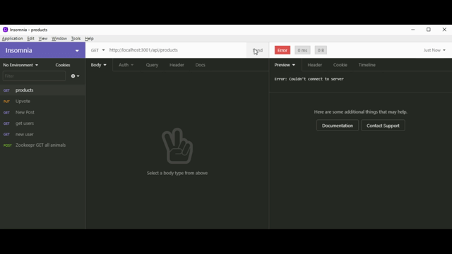
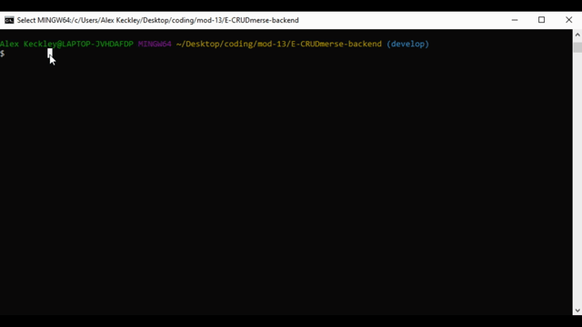

# E-CRUDmerse-backend

The E-CCRUD-merse baackend.

its a build of the CRUD methodolgy in api structure.

* Create

* Read

* Update

* Delete

## getting started

First, lets clone the repisitory

after that's done we'll run `npm install` to get all of the dependent packages.

lets use mysql to `source` our schema file

Seed our database with `npm run seed`

Then you can run the server with `npm start`

